# Привет! Меня зовут Елена Лаврушева 👋

🏢 Я - **Data Analyst** | Помогаю увидеть картину происходящего в настоящем и будущем через призму данных. За каждой цифрой скрывается решение. Моя задача — сделать связи очевидными и понятными

📚 Для меня аналитика данных — это глубокая страсть к поиску истины в цифрах

💪 Моя сильная сторона — не только во владении инструментами (Python, Pandas, SQL, визуализация), но и во врожденном любопытстве, которое движет мной в поиске причин, следствий и скрытых закономерностей. Я постоянно совершенствую свои Hard Skills, применяя их в работе и жизни

---

## 🛠️ Технологический стек и навыки

### 🗄️ Main Stack
- **Programming Languages & Querying:**

- **Data Analysis & Machine Learning:**

- **Data Visualization and Version Control:**

- **Development & Tools:**

### 📈 My Projects
#### Python и библиотеки для анализа:
  -  Анализ сотрудников компании и факторов увольнений (поиск инсайтов, подготовка рекомендаций для cтейкхолдеров) [presentation](https://docs.google.com/presentation/d/1T62pE2gxabrzqUdDwJtrXIX00CGbjE3W-6_ucWyvaAw/edit?usp=drive_link), [documentation](https://docs.google.com/document/d/1nRBsEwDocHEfVZivZRKNHM0efwtv2Zam/edit?usp=drive_link&ouid=115475321101961781777&rtpof=true&sd=true), [notebook](https://colab.research.google.com/drive/1YcXaNxrBdmPzy8ZANEDmNNY0ZCgDsBiS?usp=drive_link)
#### SQL и поиск данных:
  - [Авиаперевозки](https://github.com/Elen-Lavr/Elen-Lavr-Aviation-Transportation-SQL-Analytics)
  - [Анализ данных SQL Pro](https://github.com/Elen-Lavr/Data-Analysis-SQL-Pro)

### 💻 Мой coding-challenges
  - [Coding-challenges SQL](https://github.com/Elen-Lavr/my-coding-challenges-SQL)

### 🧠 Soft Skills
- **Бизнес-мышление & Коммуникация.** Опыт управления организацией научил меня переводить бизнес-проблемы на язык данных и доносить инсайты до любой аудитории
- **Управление проектами.** Имею опыт полного цикла управления проектами: от идеи и планирования до реализации и анализа результатов
- **Решение сложных задач.** Применяю системный подход к решению проблем: от выдвижения гипотез до внедрения решений, основанных на данных
- **Работа в команде & Лидерство.** Умею мотивировать команду и эффективно взаимодействовать с людми из разных рабочих сфер

---
##  💼 Квалификационные документы
[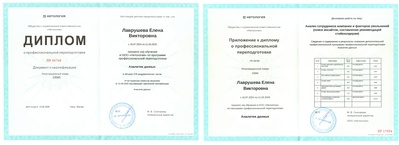](education/Diploma_with_honors.jpg)
[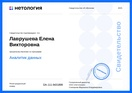](education/images/Data_Analyst_page.jpg)
[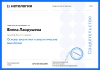](education/images/Fundamentals_of_Analytics_and_Analytical_Thinking_page.jpg)
[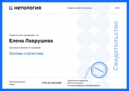](education/images/Fundamentals_of_Statistics.jpg)
[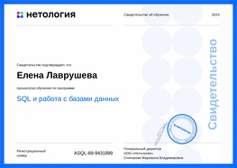](education/images/SQL_and_working_with_databases-01.jpg)
[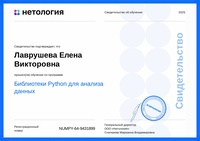](education/images/Python_Libraries_for_Data_Analysis.jpg)
[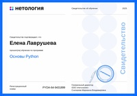](education/images/Python_Basics.jpg)
[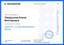](education/images/DataVizArt_Data_Visualization_Basics_page.jpg)
[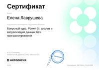](education/images/Power-BI-Data_Analysis_and_Visualization_Without_Programming.jpg)
[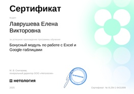](education/images/Working_with_Excel_and_Google_Sheets.jpg)
[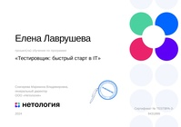](education/images/Tester.jpg)

Диплом с отличием [Аналитик данных](./education/Diploma_with_honors.jpg);
Сертификаты: [Аналитик данных](./education/Data_Analyst.pdf);
[Основы аналитики и аналитическое мышление](./education/Fundamentals_of_Analytics_and_Analytical_Thinking.pdf);
[Основы статистики](./education/Fundamentals_of_Statistics.pdf);
[SQL и работа с базами данных](./education/SQL_and_working_with_databases.pdf);
[Библиотеки Python для анализа](./education/Python_Libraries_for_Data_Analysis.pdf);
[Основы Python](./education/Python_Basics.pdf);
[DataVizArt: Основы визуализации данных](./education/DataVizArt_Data_Visualization_Basics.pdf);
[Power BI: анализ и визуализации данных без программирования](./education/Power-BI-Data_Analysis_and_Visualization_Without_Programming.pdf);
[Работа с Excel и Google-таблицами](./education/Working_with_Excel_and_Google_Sheets.pdf);
[Тестировщик](./education/Tester.pdf)

---

 &nbsp; 

 &nbsp; 

---

⭐ *Готова присоединиться к команде, где смогу использовать свои аналитические способности для извлечения actionable insights. Заинтересована в проектах, связанных с анализом бизнес-показателей, построением дашбордов или исследовательским анализом.*
