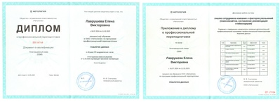
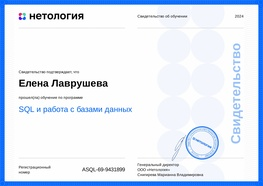
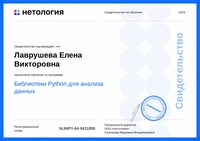
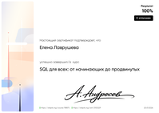
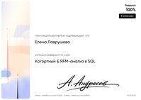

💪 Моя сильная сторона — не только во владении инструментами (Python, Pandas, SQL, визуализация), но и в стремлении, которое определяет мой подход к анализу: расширить контекст, понять полную картину и, как итог, — выявить и минимизировать скрытые риски. Именно поэтому мое развитие — это системная работа: я слежу за эволюцией инструментов и методологий, чтобы мой анализ всегда опирался на современные и релевантные подходы.

<table>
  <tr>
    <td>
      
    </td>
    <td>
      
    </td>
  </tr>
</table>
---

## 🗄️ Мой Stack
- **Programming Languages & Querying:**

- **Data Analysis & Machine Learning:**

- **Data Visualization and Version Control:**

- **Development & Tools:**

## 📈 Мои Projects
### Python и библиотеки для анализа:
  -  [Анализ данных о сотрудниках для выявления ключевых факторов, влияющих на увольнение.](https://github.com/Elen-Lavr/employee-turnover-analysis) Проект включает в себя очистку данных, исследовательский анализ (EDA) и подготовку презентации для стейкхолдеров с рекомендациями по снижению текучести.
[presentation](https://docs.google.com/presentation/d/1cYFqdsvFXwrm2EBuayYcN8pmMZcscPsEOAlFd3zDFnM/edit?usp=sharing),
[documentation](https://docs.google.com/document/d/119lXDI0AYYLA3yuSu7ljw8LWE_jdpA5H/edit?usp=sharing&ouid=115475321101961781777&rtpof=true&sd=true),
[notebook](https://colab.research.google.com/drive/1FHPClMnPge8wcgn8mwqqU-9KbXaVzneG)
### SQL и поиск данных:
  - [Data-Driven-PostgreSQL](https://github.com/Elen-Lavr/Elen-Lavr-Aviation-Transportation-SQL-Analytics). В рамках проекта провела всесторонний анализ данных авиакомпании, используя PostgreSQL. Решила серию бизнес-задач, включая анализ эффективности использования воздушного флота, расчет ключевых финансовых метрик (динамика выручки, классификация маршрутов по доходности, медианные значения), оценку операционной эффективности и сегментацию клиентской базы. В работе активно применял оконные функции, CTE, сложные JOIN'ы и агрегацию данных, что позволило извлечь инсайты для поддержки управленческих решений.
  - [Data-analysis-SQL-Pro](https://github.com/Elen-Lavr/Data-Analysis-SQL-Pro). В рамках проекта проведен комплексный анализ данных о проектах компании с использованием PostgreSQL. Решен ряд бизнес-задач, включая подсчет проектов по годам, анализ возраста сотрудников, расчет премий руководителей, накопительные итоги платежей и рекурсивный анализ организационной структуры, что обеспечивает глубокую аналитику для управленческих решений.
### Кейсы из практики:
[Решения реальных задач](https://github.com/Elen-Lavr/data-analysis-case-studies?tab=readme-ov-file)

## 💻 Мой coding-challenges
  - [Coding-challenges SQL](https://github.com/Elen-Lavr/my-coding-challenges-SQL)

## 🧠 Soft Skills
- **Бизнес-мышление & Коммуникация.** Опыт управления организацией научил меня переводить бизнес-проблемы на язык данных и доносить инсайты до любой аудитории
- **Управление проектами.** Имею опыт полного цикла управления проектами: от идеи и планирования до реализации и анализа результатов
- **Решение сложных задач.** Применяю системный подход к решению проблем: от выдвижения гипотез до внедрения решений, основанных на данных
- **Работа в команде & Лидерство.** Умею мотивировать команду и эффективно взаимодействовать с людми из разных рабочих сфер

---
##  💼 Квалификационные документы
### Галерея сертификатов *(нажмите на изображение для просмотра в полном размере）*

---
 &nbsp; 
---

⭐ *Готова присоединиться к команде, где смогу использовать свои аналитические способности для извлечения actionable insights. Заинтересована в проектах, связанных с анализом бизнес-показателей, построением дашбордов или исследовательским анализом.*
